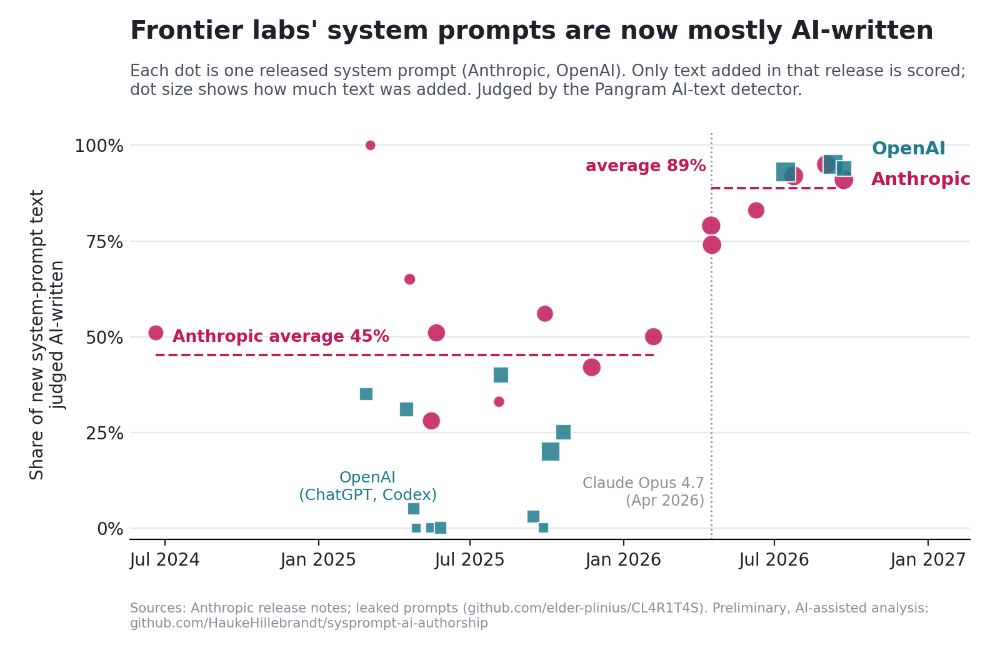

# Who writes the system prompt?

An outside-in indicator of AI R&D automation at frontier labs: how much of the newly written text in Anthropic's and
OpenAI's deployed system prompts is AI-authored, June 2024 to September 2026.

**Draft paper:** [`paper/main.pdf`](paper/main.pdf)

> **Disclaimer: this is vibecoded.** The pipeline, statistics, figures and the first draft of the paper were produced
> largely by an AI coding agent (Claude Opus 5.5 in Claude Code) under my direction over two days, with only light
> human review so far. The AI-written detector controls were written by the same model. Note the potential conflict:
> an Anthropic model analysed Anthropic's prompts. Treat the numbers as a preliminary exploration, not a peer-reviewed
> result. Corrections and replications welcome.

## Main results

| | Before | After |
|---|---|---|
| Anthropic consumer prompt, AI share of newly written text | 45% (95% CI 37–52), Jun 2024–Feb 2026 | 89% (81–94), Apr–Sep 2026 |
| OpenAI prompts, AI share of newly written text | 23% (15–31), 2025 | 93–95%, 2026 Codex app (GPT-5.6 Sol, GPT-6) |
| Safety-policy text, AI share (Anthropic / OpenAI) | 46% / 29% | 82% / 96% |
| Share of the full deployed prompt that was AI-written when added | ~36–39% (Anthropic, 2025) | ~80% (Anthropic), 82–93% (OpenAI) |
| Anthropic median days between new models | 73 | 22.5 (permutation p = 0.011) |

- The best-fitting change point for Anthropic is between Opus 4.6 (Feb 2026) and Opus 4.7 (Apr 2026). A detector-free
  check agrees: 18 of 18 official Anthropic prompt versions before April 2026 contain zero em-dashes in their new text
  (dashes were typed as `" - "`); from Opus 4.7 on, model-style em-dashes appear.
- No upward drift before the break (Anthropic +1.5 pp/yr, CI −12 to +34).
- What is still human-written in the newest prompts: terse tool/parameter reference text, product facts and URLs, legacy
  passages that were never rewritten (e.g. OpenAI's May 2025 `AGENTS.md` spec, verbatim in GPT-6), and at OpenAI a set of
  agent sandbox/destructive-action rules. The only typos found sit in human-labelled passages.
- Interpretation: strong evidence that labs' own writing work crossed an automation threshold in spring 2026, matching
  Anthropic's self-reports; weak evidence about recursive self-improvement in the sense of accelerating returns to AI
  research (system prompts are deployment configuration, and one step is not a feedback loop).



More figures: [`paper/figs/`](paper/figs).

## Method in brief

1. Order each lab's prompts by date; keep only **first-appearance text** (lines whose sentences have not appeared in any
   earlier prompt), so carried-over passages are never re-counted.
2. Score it with the **Pangram 4** AI-text detector (web dashboard, about 2,900 credits in total). Controls: Anthropic's
   2023 constitution post 0% AI; full Claude rewrites of prompt passages 91–100%; a light Claude edit of human text 43%.
3. Map Pangram's segment labels back to lines and prompt sections; attribute every sentence of each deployed prompt to the
   version where it first appeared.
4. Statistics: document-level cluster bootstrap, change-point search, pre-break drift, misclassification correction,
   permutation test on release gaps. Two very large OpenAI 2026 files were scored by systematic sampling (validated: the
   unsampled half of GPT-5.6 Sol scored 92% vs 94% in the sample).

## Reproduce

```bash
./fetch_data.sh                                   # leaked prompts (pinned commit), official Anthropic prompts, control text
python3 prep_newtext.py && python3 prep_openai.py # first-appearance text
python3 sample_openai.py && python3 sample_openai_extra.py
# Detector step: the Pangram labels used are included as segs.tsv, segs_openai.tsv, segs_openai_extra.tsv
python3 leak_markers.py                           # stylometry
python3 analyze.py > results/analysis_output.txt && python3 analyze_openai.py
python3 export_plot_data.py && python3 stats.py && python3 make_figures.py && python3 make_tables.py
tectonic paper/main.tex                            # or pdflatex + bibtex
```

The leaked and official prompts, and every file containing them verbatim, are deliberately not included in this repo;
`fetch_data.sh` re-downloads them. Official pages may have changed since they were accessed (30 Sep 2026).
`extract_store*.js` are the browser snippets used to read segment labels off the Pangram dashboard. `page/` is a
standalone HTML write-up with interactive charts (Anthropic only).

## Files

| Path | What |
|---|---|
| `prep_newtext.py`, `prep_openai.py` | first-appearance text per prompt set |
| `sample_openai*.py` | systematic samples of the two largest OpenAI 2026 files |
| `segs*.tsv` | Pangram segment labels (label, confidence, words, opening characters) |
| `analyze.py`, `analyze_openai.py` | segment→line mapping, section analysis, stock attribution |
| `stats.py`, `make_figures.py`, `make_main_figure.py`, `make_tables.py`, `export_plot_data.py` | statistics, figures and tables |
| `qual_extract.py` | extracts human-labelled passages for the qualitative analysis (output not redistributed) |
| `results/` | numeric outputs |
| `paper/` | LaTeX source, bibliography, figures, PDF |

## Licence

Code: MIT (see `LICENSE`). Paper text and figures: CC BY 4.0. Third-party prompt text belongs to its owners and is not
included.
